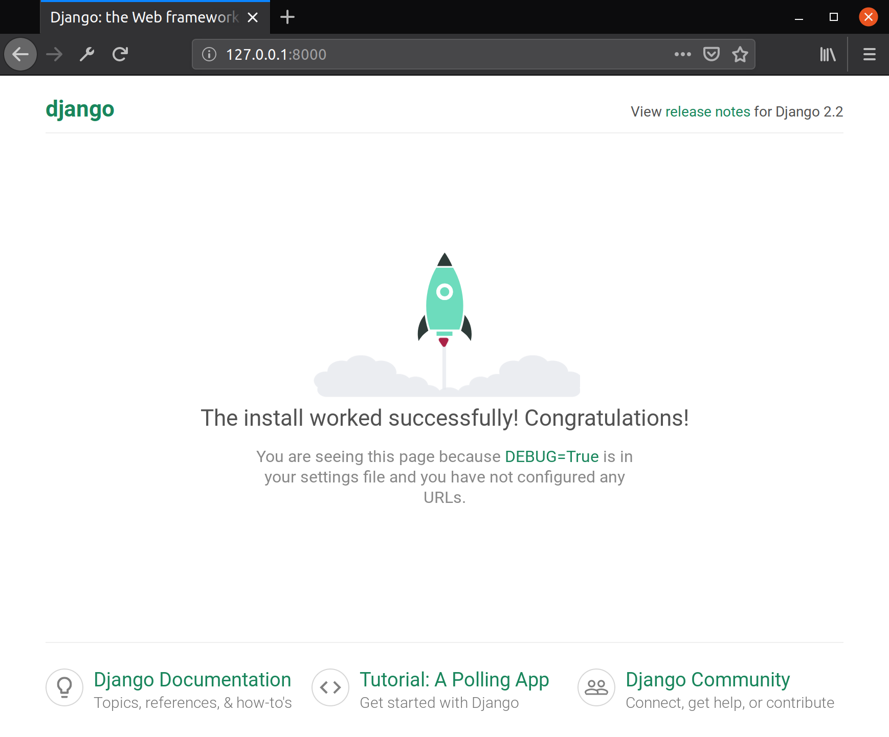
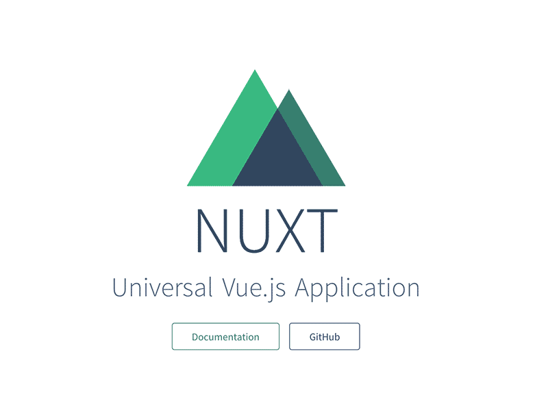

# Pravo Bot Project


### Main Stack:
    
- Backend:
    - Python
    - Framework: Django + Django-Rest-Framework
- Frontend:
    - JavaScript
    - Framework: Vue.js + Nuxt


### Этап 1.
#### Устанавливаем и настаиваем окружения для работы.

Back
1. ```python3 -m venv venv ``` Настраиваем виртуальное окружение Python.
2. ```source venv/bin/activate ``` Запускаем виртуальное окружение Python.
3. ```pip install django ``` Устанавливаем Django
4. ``` django-admin startproject <project_name> ``` Создаем новый Django-проект.
5. Создаем файл requirements.txt, в который будем вносить все зависимости связанные с проектом.
6. ``` python manage.py runserver ``` Проверяем запускается ли проект.
7. Должна появится стартовая страница Django.

___

Front
1. Устанавливаем Node JS по интсрукции для своей операционной системы.
[Инструкции здесь](https://nodejs.org/ru/download/package-manager/)
2. Создаем чистый Nuxt Js проект по инструкции из официальной документации.
[Инструкции здесь](https://ru.nuxtjs.org/). <br>
По умолчанию добавляем плагины:
    - Axios.js для отправки http запросов.
    - Vuetify.js - UX/UI фреймворк для помощи в создании приятного интерфейса.
3. ``` npm run dev ``` Проверяем запускается ли проект.
7. Должна появится стартовая страница Nuxt.
